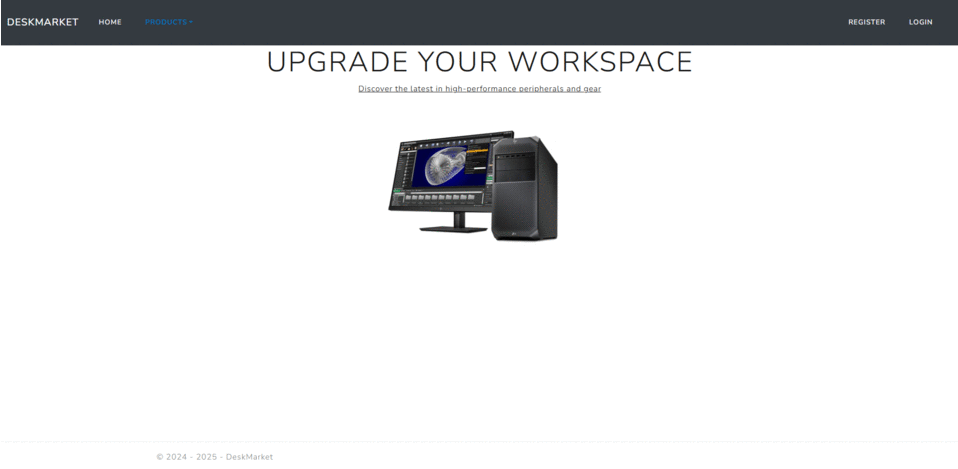
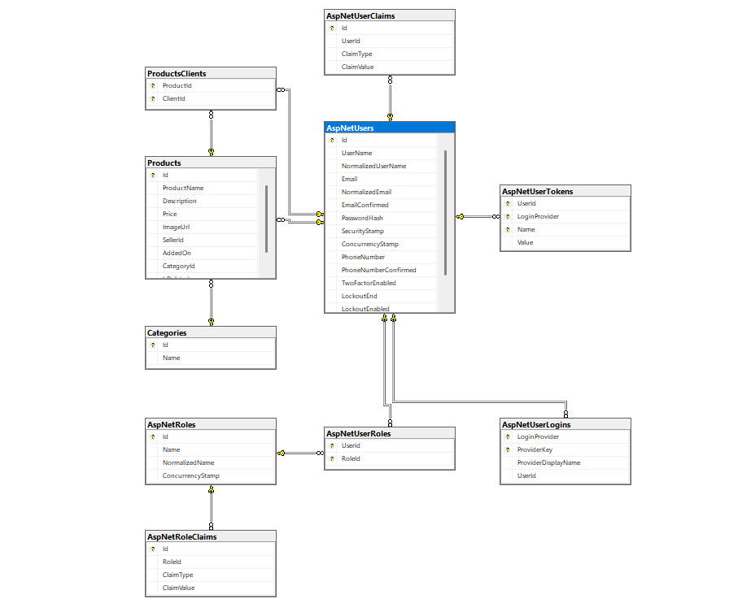

# Short introduction
DeskMarket is a website for selling computer parts and accessories. It was my final project for the ASP.NET Fundamentals course at Software University.

# Front-End
The Fronyt-End contains HTML, CSS + Bootstrap, JavaScript, and Razor Pages.
All the Razor Pages are designed and written entirely by me as well as a part of the CSS.
There is Front-End verification for the login, register fields, and edit page fields.
Every redirection made by the client from the website loads the corresponding Razor Page.

# Back-End
The database was entirely designed constructed and written by me.
I used the Code-First approach with the help of Entity Framework to build my DataBase.
As this is a C# project, I used TSQL, SSMS, and SQL Server.
There is Back-End verification for every field on the website.
The connection between the server and the Front-End is made with the help of ASP.NET Framework, using the ApplicationDbContext class and the UserManager class.

# Additional
The website uses the async-await pattern so it is thread-safe and competitive.
All the commands from the client side are translated to Tasks on the Server side.
The application uses Controllers but not Services.

# Future
The plan for this project contains adding Services, logging in with Instagram and Facebook, using SignalR and much more.
